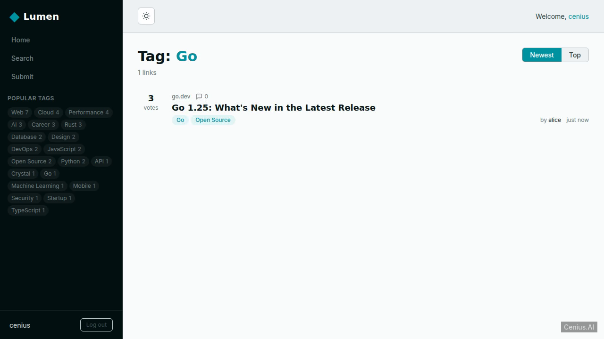
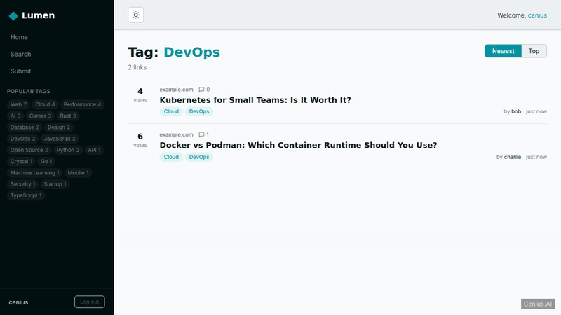
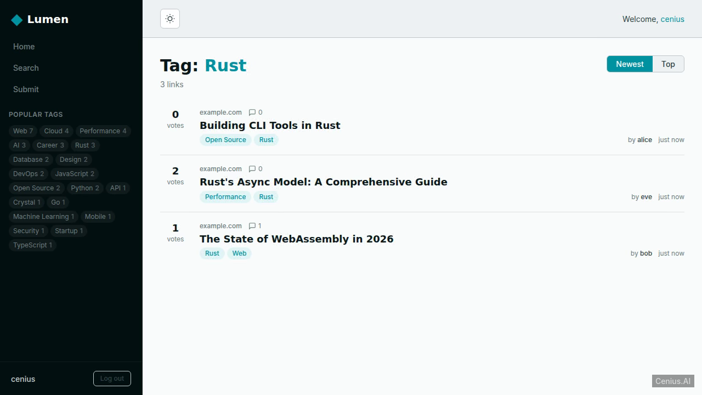
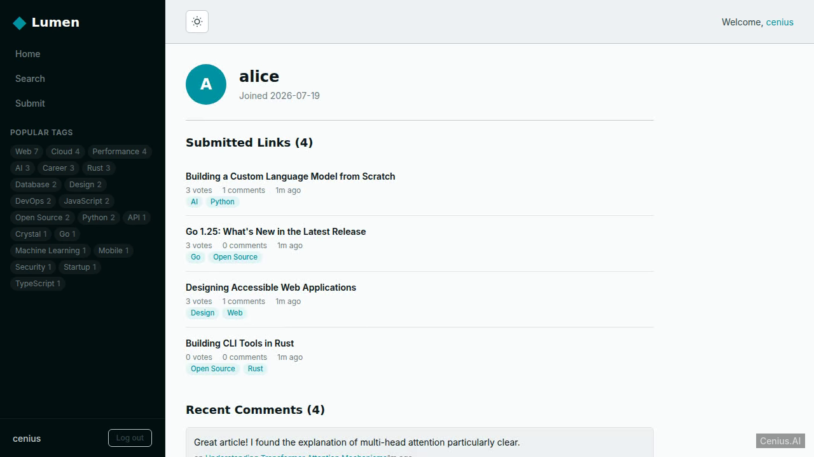
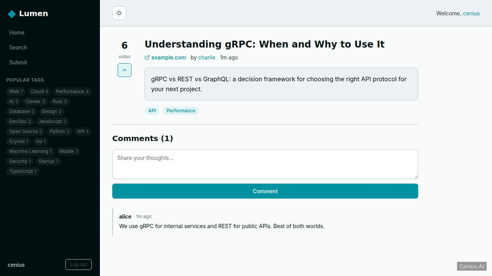

# Lumen — production-ready Crystal social network app starter

**Lumen** is a free, open-source social network app built with Crystal. Lumen is a tech news link aggregator built with Kemal (Crystal) that features full social functionality: user submissions with user-defined tags, upvoting/downvoting, threaded comments, and user accounts with email/pa…. Run it locally, deploy it as a self-hosted social network app, or [remix it on cenius.ai](https://cenius.ai/marketplace/p/lumen?ref=gh&utm_campaign=lumen-crystal) to make it your own — the whole application (code, design, seeded demo data) ships in this repository under the MIT license.

[](LICENSE)  [](https://cenius.ai)

## Demo





▶ **[Watch the full demo video](https://cenius.ai/marketplace/p/lumen?ref=gh&utm_campaign=lumen-crystal)** — the complete walkthrough, playing on the project's cenius.ai page · [MP4 file](.github/media/demo.mp4)

## Screenshots

  

## Features

- User Authentication
- Link Submission with Tags
- Voting
- Tagging System
- Commenting
- User Profiles
- Light/Dark Theme Toggle
- Search
- Responsive Design
- Browse by Tag and Sort

## Quick start

```bash
./install.sh   # installs dependencies + seeds demo data
```

See [`INSTALL.md`](INSTALL.md) for full setup and usage instructions.

## Usage guide

Once Lumen is running (see [INSTALL.md](INSTALL.md)), open your browser at `http://localhost:3000`. Below is a guide to the main features and how to interact with them.

### Home Page

The home page (`/`) displays a list of submitted links, ordered by recency (or votes, depending on the implementation). Each link shows its title, URL, tags, and submission metadata.

**Example request:**
```bash
curl http://localhost:3000/
```

### Submitting a Link

Navigate to `/links/submit` or click the “Submit” button in the navigation bar. Fill in the form with a title, URL, and a comma-separated list of tags. After submission, you will be redirected to the newly created link’s page.

**Example submission (if the form uses POST):**
```bash
curl -X POST http://localhost:3000/links \
  -d "title=My Title&url=https://example.com&tags=tech,news"
```
*(Note: exact parameter names depend on the implementation; adjust accordingly.)*

### Viewing a Link

Each link has a detail page at `/links/:id` where you can see the full information and possibly comments or actions.

```bash
curl http://localhost:3000/links/1
```

### Browsing by Tag

Click on any tag (e.g., “tech”) to see all links associated with that tag at `/tags/:tag`.

```bash
curl http://localhost:3000/tags/tech
```

### Searching

Use the search box to perform a keyword search. Results appear at `/search?q=your+keywords`.

```bash
curl "http://localhost:3000/search?q=crystal"
```

### User Account

_Full guide: [`USAGE.md`](USAGE.md)_

## Architecture

Crystal application, delivered as a complete, runnable project (248 files). Top-level layout: `bin/`, `lib/`, `public/`, `src/`, `views/`. `install.sh` provisions dependencies and seeds demo data, so the app boots with something to show. Setup details live in [`INSTALL.md`](INSTALL.md).

## FAQ

### What does it take to self-host Lumen?

Everything you need ships in this repo: clone it, run `./install.sh` to install dependencies and seed demo data, then follow [`INSTALL.md`](INSTALL.md) to start it. No external services required.

### What powers Lumen under the hood?

Crystal. The full source in this repository is exactly what the app runs. Highlights include light/Dark Theme Toggle.

### Is Lumen free for commercial use?

Yes. The code is MIT-licensed — use it, modify it, and ship it commercially. See [LICENSE](LICENSE).

### Can I rebrand or white-label Lumen?

Yes. You can edit the source directly under the MIT license, or [remix it on cenius.ai](https://cenius.ai/marketplace/p/lumen?ref=gh&utm_campaign=lumen-crystal) — the platform route grants full rebrand and relicense rights over your derivative.

### How can I customize Lumen without editing code?

Open it on [cenius.ai](https://cenius.ai/marketplace/p/lumen?ref=gh&utm_campaign=lumen-crystal) and describe the changes you want in plain English — the platform modifies the app and gives you a new, downloadable build.

## License & rebranding

Released under the [MIT License](LICENSE) (© 2026 Cenius AI) — free for personal and commercial use.

**Need a customized version?** [Remix this app on cenius.ai](https://cenius.ai/marketplace/p/lumen?ref=gh&utm_campaign=lumen-crystal) — modifications made on the platform come with **full rebrand & relicense rights** over your derivative.

## Built with cenius.ai

This entire application — code, design, seeded demo data — was generated on **[cenius.ai](https://cenius.ai)** from a plain-English description.

- 🚀 [Build your own app on cenius.ai](https://cenius.ai)
- 🎛️ [Remix Lumen on the marketplace](https://cenius.ai/marketplace/p/lumen?ref=gh&utm_campaign=lumen-crystal) — open it in a workspace, prompt for changes, and ship your own version.

More open-source apps: [the Cenius-ai catalog](https://github.com/Cenius-ai) · [showcase index](https://github.com/Cenius-ai/showcase)
